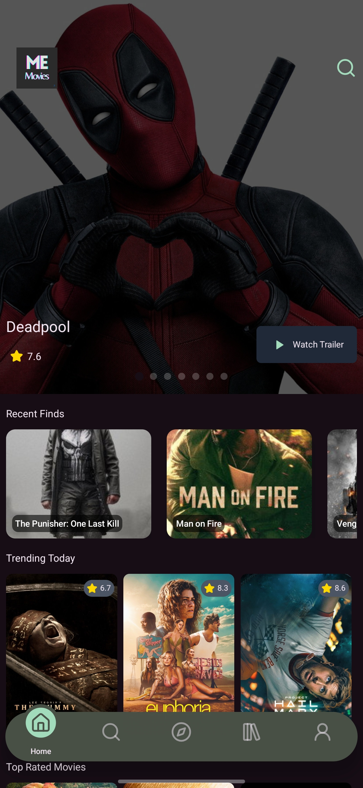
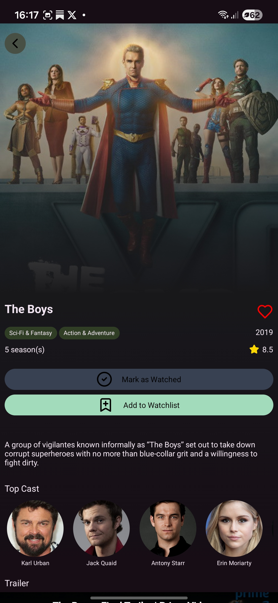
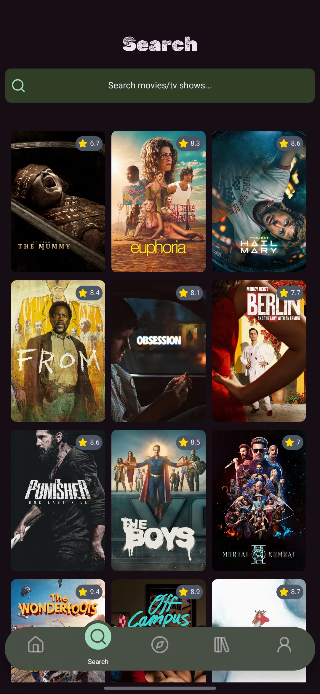
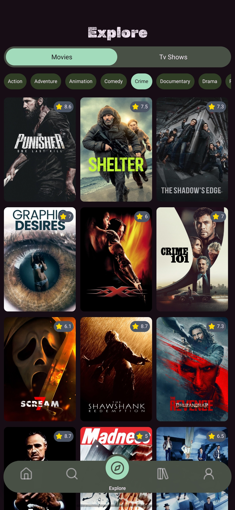
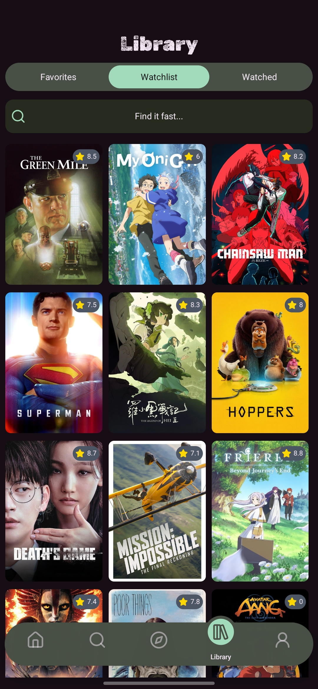

# MeMovies Mobile

MeMovies Mobile is a mobile application for movie and TV show enthusiasts. It allows you to explore, search, and curate your personal watching catalog with ease, ensuring all your preferences are synced with the MeMovies web version.

## Key Features

- **Browse** movies and TV shows by genre to discover new content.
- **Search** for specific movies and TV shows easily.
- **Curate your catalogue**: Save favorites, add items to your watchlists, and mark films as watched.
- **Seamless Syncing**: Your user details and film catalogues are synced in real-time with the web version.

## Screenshots

<div style="display: flex; flex-direction: row; overflow-x: auto; gap: 10px;">
  
  
  
  
  
</div>

## Download Beta Release

A beta release of the app is available for download! Head over to the **Releases** section of this repository on GitHub to download the latest installation files and try it out on your device. 

## Contributing

We welcome contributions from the community! If you are willing to contribute, please follow these steps:
1. Fork the repository.
2. Create a new branch for your feature or bugfix (`git checkout -b feature/your-feature-name`).
3. Commit your changes (`git commit -m 'Add some feature'`).
4. Push to the branch (`git push origin feature/your-feature-name`).
5. Open a Pull Request.

Feel free to open an issue for any bugs you find or features you would like to request.

## Local Development Setup

1. Install dependencies:
   ```bash
   npm install
   ```
2. Start the app:
   ```bash
   npx expo start
   ```
